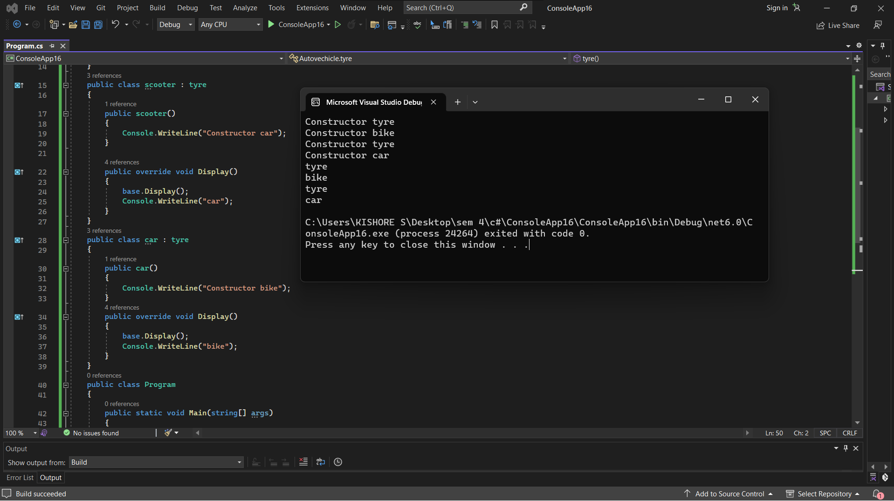

# Inheritance

## Aim:
To write a C# program to print some messages using hierarchical inheritance
## Algorithm:
### Step 1:
Create a base class.

### Step 2:
Create two child class.

### Step 3:
Create a constructor in the base class and print a message.

### Step 4:
Create a function in child class to print a message.
## Program:

Developed by : Kishore kumar S

Reg no: 212221240023

```
using System;
namespace Autovechicle
{
    public class tyre
    {
        public tyre()
        {
            Console.WriteLine("Constructor tyre");
        }
        public virtual void Display()
        {
            Console.WriteLine("tyre");
        }
    }
    public class scooter : tyre
    {
        public scooter()
        {
            Console.WriteLine("Constructor car");
        }

        public override void Display()
        {
            base.Display();
            Console.WriteLine("car");
        }
    }
    public class car : tyre
    {
        public car()
        {
            Console.WriteLine("Constructor bike");
        }
        public override void Display()
        {
            base.Display();
            Console.WriteLine("bike");
        }
    }
    public class Program
    {
        public static void Main(string[] args)
        {
            car cd = new car();
            scooter cdd = new scooter();
            cd.Display();
            cdd.Display();
        }
    }
}
```


## Output:


## Result
C# program to print some messages using hierarchical inheritance is implemented successfully.